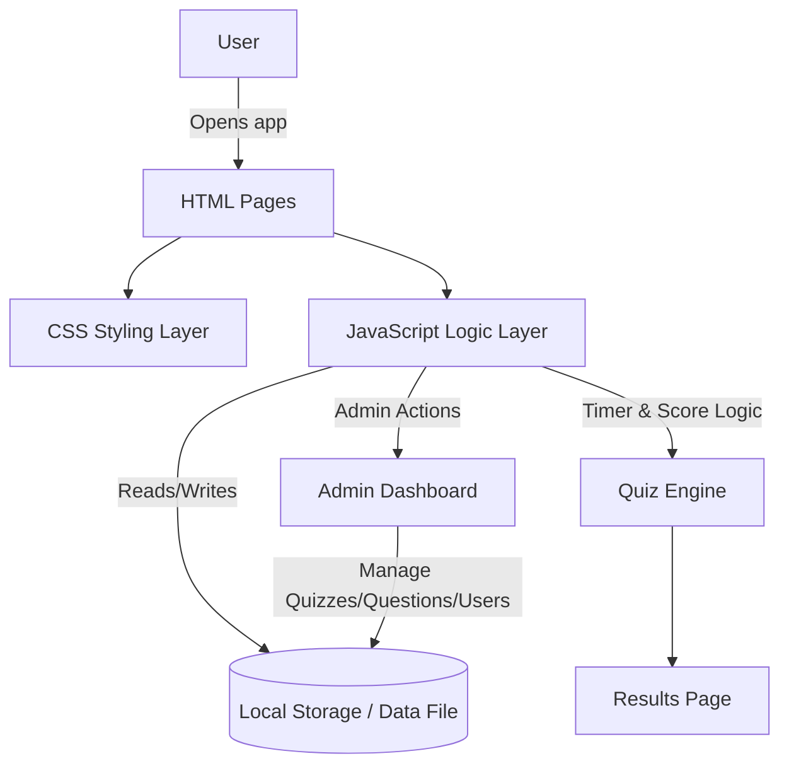

# 📝 Online Quiz System

An Online Quiz System is a web application that allows users to register, log in, take quizzes, and view their scores instantly. Administrators can manage quizzes, questions, and users through a dedicated dashboard.

---

## 📖 Table of Contents

- [Features](#-features)
- [Tech Stack](#-tech-stack)
- [System Architecture](#-system-architecture)
- [Workflow](#-workflow)
- [User Roles](#-user-roles)
- [Page Structure](#-page-structure)
- [Project Structure](#-project-structure)
- [Installation & Setup](#-installation--setup)
- [Future Scope](#-future-scope)
- [Author](#-author)

---

## 🚀 Features

| Feature | Description |
|---|---|
| 📝 Create & Attempt Quizzes | Users can take quizzes created by the admin |
| ⏱️ Timer-Based Quiz | Each quiz runs on a countdown timer, auto-submitting when time runs out |
| ⚡ Instant Score & Results | Score is calculated and displayed immediately after submission |
| 🛠️ Admin Dashboard | Admin can add/edit/delete quizzes, questions, and manage users |
| 📱 Responsive Design | Works smoothly across desktop, tablet, and mobile screens |

---

## 🛠️ Tech Stack

| Layer | Technology |
|---|---|
| Structure | HTML |
| Styling | CSS |
| Logic / Interactivity | JavaScript |
| Data Storage | Browser Storage (localStorage / JSON) |

---

## 🏗️ System Architecture



---

## 🔄 Workflow

| Step | Action |
|---|---|
| 1 | User registers or logs in through the login/signup page |
| 2 | User selects a quiz from the available list |
| 3 | Quiz engine loads questions and starts the countdown timer |
| 4 | User answers questions; JavaScript tracks selected answers in real time |
| 5 | Quiz auto-submits when the timer ends, or user submits manually |
| 6 | Score is calculated instantly by comparing answers to the correct key |
| 7 | Results page displays the score and a summary of correct/incorrect answers |
| 8 | Admin can log in separately to add/edit quizzes, questions, and manage registered users |

---

## 👥 User Roles

| Role | Capabilities |
|---|---|
| **User** | Register, log in, attempt quizzes, view instant results |
| **Admin** | Create/edit/delete quizzes and questions, manage users, view overall activity |

---

## 📄 Page Structure

| Page | Purpose |
|---|---|
| `index.html` | Landing page / login-signup |
| `quiz.html` | Displays quiz questions with timer |
| `result.html` | Shows score and answer summary after submission |
| `admin.html` | Admin dashboard for managing quizzes and users |

---

## 📁 Project Structure

```
online-quiz-system/
├── index.html          # Login / landing page
├── quiz.html           # Quiz-taking interface
├── result.html         # Score & results page
├── admin.html          # Admin dashboard
├── css/
│   └── style.css       # Styling for all pages
├── js/
│   ├── auth.js         # Login/signup logic
│   ├── quiz.js         # Quiz engine (timer, scoring, navigation)
│   ├── admin.js        # Admin CRUD operations for quizzes/questions
│   └── storage.js      # Handles data read/write (localStorage/JSON)
└── data/
    └── questions.json  # Quiz questions data
```

---

## ⚙️ Installation & Setup

```bash
# Clone the repository
git clone https://github.com/<username>/online-quiz-system.git
cd online-quiz-system

# No build tools required — just open in browser
# Simply open index.html in your browser
```

> Since this project uses plain HTML, CSS, and JavaScript, no server or dependencies are needed to run it locally.

---

## 🚀 Future Scope

- Backend integration (Node.js/Express + database) for persistent, multi-device data storage
- User authentication with secure password hashing
- Category-wise and difficulty-wise quizzes
- Leaderboard to rank users by score
- Negative marking and detailed analytics per quiz attempt

---

## 👨‍💻 Author

**Adarsh Gupta**
